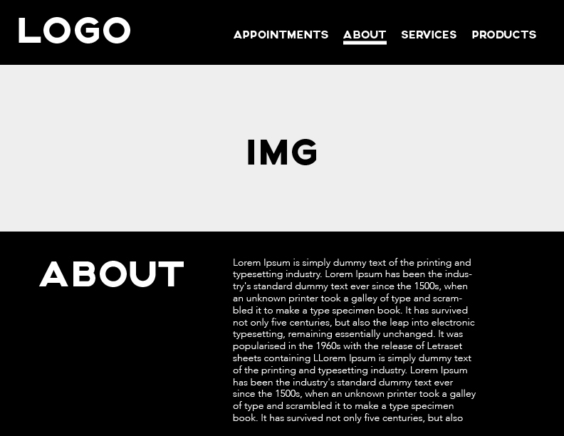
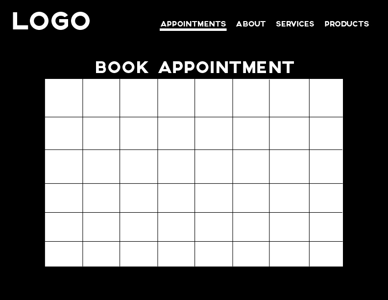

# Proposal - Alejandra Hair Salon
‘Alejandra Hair Salon’ is a web app for a hair salon located at the heart of little Italy in the Bronx. This web app aims to serve as a virtual storefront to brand the business to become recognizable, differentiated, and consistent among other competitors in the area. The app will have a booking system that will allow customers to book appointments. 

# User Stories
- When a new customer visits the app, the first screen will have either a full screen slideshow or a background video. 

- A navigation with ABOUT/SERVICES/HOURS & LOCATION/APPOINTMENTS

- A customer/user would have the ability to book, reschedule and cancel an appointment.

# Wireframes

# Technologies
# React 
The App uses React for the front-end file structure and routing between pages.

# Rails
The Rails-Backend handles the requests that the front end sends. This happens via routing requests.

# Postgres/SQL
The App uses a database table consisting of three columns for the handling of the bookings

# Materialize.css
The App uses a Material Design based front-end framework that allows it to be responsive and modular.
