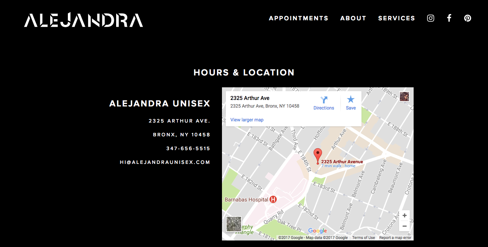
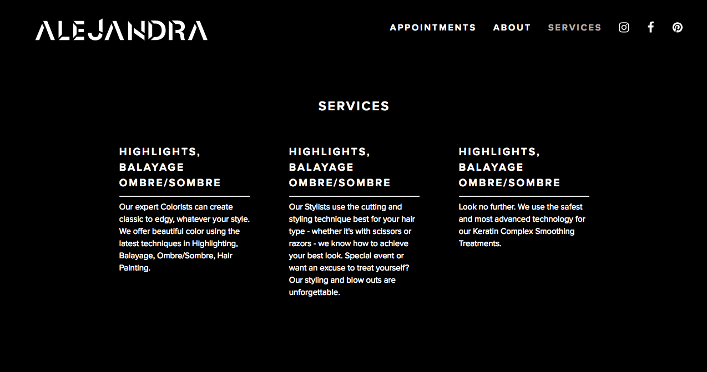

# Alejandra Unisex Hair Salon 
‘Alejandra Hair Salon’ is a web app for a hair salon located at the heart of little Italy in the Bronx. This web app aims to serve as a virtual storefront to brand the business to become recognizable, differentiated, and consistent among other competitors in the area. The app will have a booking system that will allow customers to book appointments. 

[Deployed app in Heroku](https://alejandra-unisex.herokuapp.com/)

## Homepage


## Booking page


## Hours & Location page


## Services page


# User Stories
- When a new customer visits the app, the first screen will have either a full screen slideshow or a background video. 

- A navigation with ABOUT/SERVICES/HOURS & LOCATION/APPOINTMENTS

- A customer/user would have the ability to book, reschedule and cancel an appointment.

# Technologies
# React 
The App uses React for the front-end file structure and routing between pages.

# Rails
The Rails-Backend handles the requests that the front end sends. This happens via routing requests.

# Postgres/SQL
The App uses a database table consisting of three columns for the handling of the bookings

# Materialize.css
The App uses a Material Design based front-end framework that allows it to be responsive and modular.

# Sample Code 

Axios POST request 

```javascript
handleApptSubmit = (e) => {
    e.preventDefault();
    axios('/appointments', {
      method: 'POST',
      data: {
        appointment: {
          service: this.state.service,
          appt_time: this.state.appt_time,
          hairstylist: this.state.hairstylist
        }
      }
    }).then(res => {
        this.setState({
            redirect: true,
            currentPage: 'appointments'
      });
    })
    .then(res=>{
        this.setState({
            redirect: false
      })
    })
    .catch(err => {
      console.log(err);
    });
  }
```

Axios GET request 

```javascript 
componentDidMount() {
    if(this.props.appt_id !== undefined){
        let appt_id = this.props.appt_id
        axios(`/appointments/${this.props.appt_id}`, {method: 'GET'})
            .then(res => {
                this.setState({
                    appointmentData: res.data.appointment,
                    appointmentDataLoaded: true,
                    appt_id: appt_id
                })
        });
    }else {
        this.setState({
            redirect: true,
        })
    }
}
```

# Future Improvements
Auth


